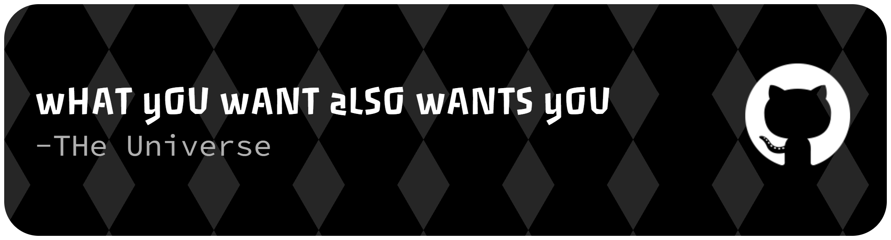

## Hi there 👋

  

### **CHASE EVERTHING YOU WANT EXCEPT LOVE AND DEATH . THEY  WILL  FIND YOU WHEN IT's TIME 🌱 — life**

### **MAKE PEACE WITH THE FACT THAT PEOPLE WILL ALWAYS SEE THIER OWN VERSION OF YOU IN THIER MINDS. YOU DON'T HAVE TO BE RESPONSIBLE FOR WHO THEY THINK YOU ARE  🌱 — life**

### **"A MAN IS MADE BY HIS OWN BELIEF .AS HE BELIEVES, SO HE BECOMES" 🌱 — life**

### **"iF THEY CAN'T DO IT .IT'S THEIR LIMIT,NOT YOUR 🌱 — life**

  

## 📌 About Me
- A resilient and methodical Computer Engineering student, blending creative direction with technical expertise in web development, UI/UX design, and performance optimization. Passionate about ethical AI, open-source contribution, and building impactful digital experiences.”

## 🧠 My Focus Areas
- 🔹 Focus Areas
- CloudOps
- MLOps
- Deep Learning Ops
- DevOps
- Software Engineering
- Full-Stack Development

## 📊 GitHub Stats & Trophies

  
  

  

  

## 🛠️ Languages & Tools

> ## Programming Languages

         

> ## Frontend

       

> ## Backend

     

> ## Database

    

> ## DevOps & Cloud

     

> ## Tools

     

  

<picture>
  <source media="(prefers-color-scheme: dark)" srcset="https://raw.githubusercontent.com/abozanona/abozanona/output/pacman-contribution-graph-dark.svg">
  <source media="(prefers-color-scheme: light)" srcset="https://raw.githubusercontent.com/abozanona/abozanona/output/pacman-contribution-graph.svg">
  
</picture>

  

<!--
**bandarapublic7-hub/bandarapublic7-hub** is a ✨ _special_ ✨ repository because its `README.md` (this file) appears on your GitHub profile.

Here are some ideas to get you started:

- 🔭 I’m currently working on ...
- 🌱 I’m currently learning ...
- 👯 I’m looking to collaborate on ...
- 🤔 I’m looking for help with ...
- 💬 Ask me about ...
- 📫 How to reach me: ...
- 😄 Pronouns: ...
- ⚡ Fun fact: ...
-->
